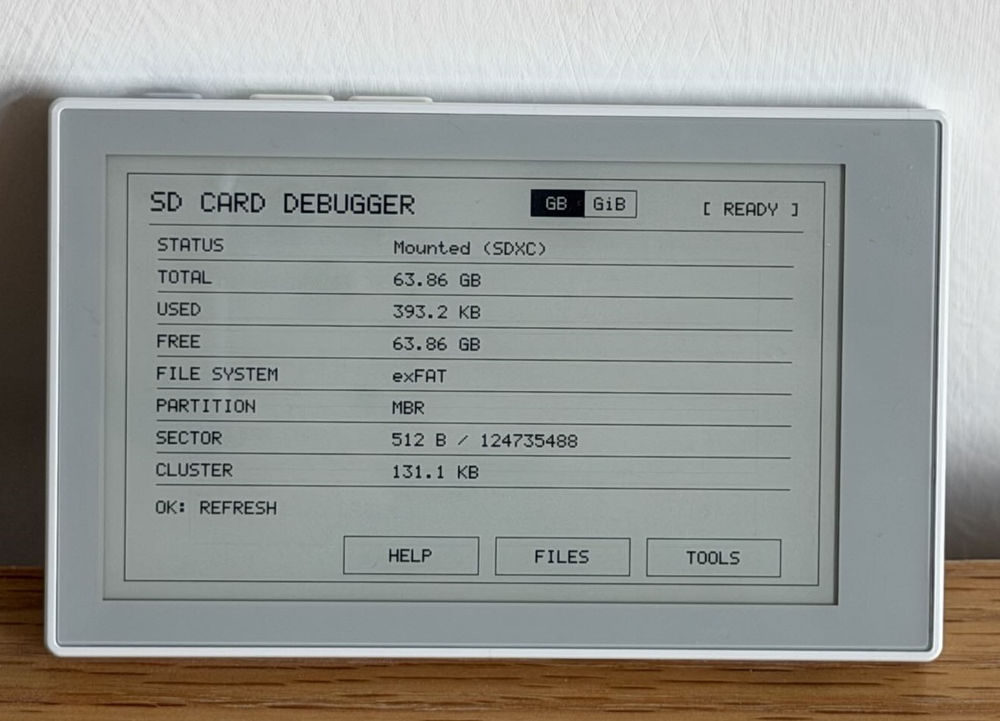

# Sticky SD Card Debugger

<div align="center">
  
</div>

这是面向 Seeed Studio reTerminal Sticky 的 ESP-IDF SD 卡信息、文件管理与诊断工具，支持目标容量范围为 4 GB～256 GB 的 FAT32 和 exFAT SD 卡。

## 编译与烧录（ESP-IDF 5.4）

使用 ESP32-S3 版 reTerminal Sticky，并打开 **ESP-IDF v5.4.0** 命令环境。在工程根目录执行：

```sh
idf.py set-target esp32s3
idf.py build
idf.py -p COM5 flash monitor
```

将 `COM5` 替换为设备实际串口；Linux/macOS 用户应使用检测到的 `/dev/...` 设备。首次编译可能需要联网下载 `main/idf_component.yml` 声明的 `espressif/cmake_utilities` 依赖。`sdkconfig.defaults` 提供目标芯片、32 MB Flash、PSRAM 和 FatFs 的默认配置。工程内的 `components/fatfs` 覆盖组件使用已安装的 ESP-IDF 5.4 源码启用 exFAT，不会修改 ESP-IDF 安装目录。构建产物、生成的 `sdkconfig` 和下载的 `managed_components` 均为本地文件，已在 Git 中排除。

烧录会替换设备当前固件。`monitor` 会输出开机 SD Card Report 及后续诊断日志。

## SD Card Info 首页

- SD 卡存在状态、原始访问状态与文件系统挂载状态
- SD 卡插入或拔出后自动检测并更新
- 总容量、已用容量和剩余容量
- FAT32 或 exFAT 文件系统识别
- 可获取时显示 MBR、GPT、分区、Sector 和 Cluster 信息
- 全局 `GB / GiB` 切换，可选择十进制（KB/MB/GB）或二进制（KiB/MiB/GiB）容量显示
- 文件系统挂载失败时，仍尽可能显示可从 Raw Diagnostics 确定的卡片信息
- `HELP`、`FILES` 和 `TOOLS` 入口

在首页按 AI/OK 可以手动重新读取 SD 卡信息。

## Files

- 支持长文件名（LFN）和分页的目录浏览
- 可通过按键或触摸进入文件夹、返回上一级目录
- 查看文件和文件夹属性，包括路径和 FAT 修改时间
- 创建文件夹，以及空的 TXT、JSON、CSV、MD 或 BIN 文件
- 删除单个文件
- 确认后递归删除空文件夹或非空文件夹
- 名称合法性检查、同名检查和 SD 卡中途拔出处理
- 使用 PCF8563 RTC 写入 FAT 时间戳；RTC 无效时，首次创建前显示屏幕日期时间设置页面

当前未实现重命名和文件内容编辑。

日常使用时，插入 SD 卡并等待首页自动更新。点击 `FILES` 浏览；使用 UP/DOWN 选择，AI/OK 或触摸进入，右上角返回箭头返回，底部箭头翻页。点击 `...` 可进入 File 或 Folder Properties，点击 `NEW` 可新建。Files 页面上滑可返回 SD Info 首页。

## Tools

### Diagnostics

只读 Raw Diagnostics 在 FAT32/exFAT 挂载失败时仍可检查 SD 卡。Summary 和 Details 页面显示卡片状态、原始卡信息、MBR/GPT 结构、分区、Boot Sector、文件系统和挂载结果；检测到 GPT 时还会显示 GPT Header、CRC 状态和有效分区项。Diagnostics 不会修复、格式化或写入原始 Sector。

### Storage Test

由用户主动启动测试。测试会创建专用临时文件，写入测试数据，重新读取并校验内容，最后删除临时文件。页面分别显示 Write、Read、Verify 和 Cleanup 结果，不会覆盖用户已有文件。

### Clear Card

用户明确确认后，Clear Card 会递归删除可挂载 SD 卡中的全部文件和文件夹。它保留现有分区表和文件系统格式，不会格式化 SD 卡，也不会写入原始分区 Sector。

### Initialize Card

用户明确确认后，Initialize Card 会擦除并重建整张卡，创建一个 MBR 主分区：

| SD 卡容量 | 初始化结果 |
| --- | --- |
| 4 GB～32 GB | MBR + FAT32，32 KiB Cluster |
| 大于 32 GB～256 GB | MBR + exFAT，Allocation Unit 由 FatFs 自动选择 |

新分区从 LBA 2048 开始，按 1 MiB 对齐。初始化会格式化预先建立的分区，随后验证 MBR、文件系统 Boot 数据和实际挂载结果；不会自动运行 Storage Test。

卡无法挂载时可先使用 Diagnostics。Storage Test 会写入并删除临时文件。Clear Card 删除全部文件和文件夹，但保留原有分区和文件系统。Initialize Card 会擦除原有布局及数据，确认前请先备份。

FAT32 和 exFAT 初始化均已通过 Sticky 重启、Windows 识别和实际文件读写验证。

## Help 与设备状态

Help 页面分为 Debugger 介绍和操作指南，说明 Files、Diagnostics、Storage Test、Clear Card 与 Initialize Card 的适用场景，并明确哪些操作会修改数据。顶部还会显示 BQ27220 电量和充电状态。长按 AI/OK 可进入 Deep Sleep。

启动时，Serial Monitor 会输出一次完整 SD Card Report，包括可靠的卡片标识、容量、Sector、接口、分区、文件系统、挂载和卷空间信息。电池状态在启动时输出一次，之后每 60 秒输出一次。

## 硬件实现

工程复用已经验证的 Sticky 驱动和 Board 初始化：

| 功能 | 实现方式 |
| --- | --- |
| 屏幕 | SSD1677，SPI2 上的 800 × 480 逻辑 Canvas；驱动会按面板方向旋转 framebuffer |
| UI | 仅 1-bit 黑白，局部刷新并定期全刷清理残影 |
| 触摸 | GT911 / I2C0，使用应用事件队列 |
| 按键 | GPIO 按键，使用现有 `iot_button` 组件 |
| MicroSD | SDSPI，与显示屏共享 SPI2 总线 |
| RTC | PCF8563，为 FAT 文件和文件夹提供时间戳 |
| 电池 | BQ27220 电量信息与 GPIO 充电状态检测 |

MicroSD 引脚为：SCK GPIO13、MOSI GPIO14、MISO GPIO12、CS GPIO8、供电使能 GPIO10（高有效）、卡检测 GPIO11（低有效）。屏幕使用独立的 GPIO15 CS。

SD 卡和电子纸共享 SPI2。所有流程都遵循已经验证的顺序：获取并初始化 SD、执行操作、卸载并释放 SD、将 SPI2 交还显示屏，最后刷新电子纸。Raw Diagnostics 复用同一套总线所有权流程，不会建立互相冲突的第二套 SD/SPI 驱动。

## 信息可靠性与安全

- 正常 VFS 挂载不可用时，由不依赖挂载的 Raw Diagnostics 提供卡片、分区和文件系统信息。
- 容量和文件大小始终保留原始 bytes/sectors 数据；GB/GiB 设置只改变显示格式。
- 无法确认或结构无效的信息会如实报告，不会猜测。
- Diagnostics 严格只读。
- Storage Test 使用避免冲突的专用临时文件，并在所有退出路径中尽量完成清理。
- Clear Card 和 Initialize Card 都必须经过用户明确确认。
- Clear Card 保留当前分区表和文件系统。
- Initialize Card 是破坏性操作，会重建分区和文件系统。

## 代码结构

- `main/main.cpp`、`main/board/`：启动与 Sticky Board 初始化
- `main/app/app.*`、`app_event.*`、`touch_input.*`：应用事件、导航、触摸分发和电子纸刷新策略
- `main/app/app_data.*`：SD Info、Diagnostics、Tools 和开机 Report 状态
- `main/app/app_file_data.*`：Files、创建和 RTC 输入状态
- `main/pages/`：SD Info、Files、Properties、创建、RTC 设置、Help 和 Tools 页面绘制；`main/ui/` 包含 Canvas、内置字体、容量格式化和公共页面控件
- `main/devices/sticky_sdcard.*`：SD 检测、共享 SPI2 生命周期、挂载、Raw Diagnostics、文件操作、Storage Test、Clear Card 和 Initialize
- `main/devices/sticky_sdcard_report.cpp`：已采集 SD Report 的格式化输出
- `main/devices/`：显示、触摸、按键、RTC、电池和电源支持
- `components/`：本地 FatFs 覆盖组件及必要的设备/按键组件；`dependencies.lock` 固定托管构建辅助组件的版本

## 验证状态

完整 FAT32 和 exFAT 流程已经在 reTerminal Sticky 实机验证，包括热插拔检测、目录浏览和文件操作、Diagnostics、Storage Test、Clear Card、Initialize、使用初始化后的 SD 卡重启 Sticky、Windows 识别以及实际文件读写。

4 GB～256 GB 是设计目标，不表示已逐一测试所有容量和品牌。本项目原创代码使用根目录的 [MIT License](LICENSE)。内置的 Espressif button 组件保留其 [Apache 2.0 许可证](components/button/license.txt)。
